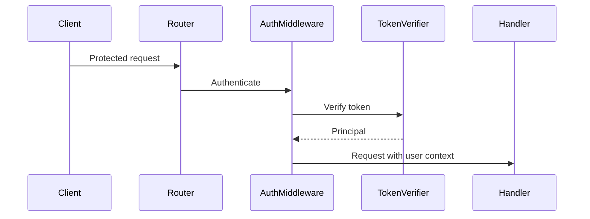

# Ariadne
## Hierarchical LLM Documentation Harness for Large Codebases

**Status:** Implementation specification  
**Intended audience:** Engineers implementing Ariadne, including coding agents such as Codex  
**Primary environment:** Large, polyglot, modular repositories in air-gapped environments  
**Primary model assumption:** A capable but context-limited local LLM, such as a roughly 30B-parameter Gemma-class model

---

## 1. Executive Summary

Ariadne is a local tool for generating a navigable, hierarchical documentation corpus for a large software repository.

It is intended for codebases that:

- are too large to fit into an LLM context window;
- contain many nested directories, packages, services, modules, and languages;
- have little or inconsistent existing documentation;
- may run in an air-gapped environment;
- may only have access to a relatively small local LLM;
- need documentation useful to both humans and coding agents.

Ariadne does not ask the model to understand the entire repository at once. Instead, it creates a logical module hierarchy, traverses that hierarchy, assembles bounded context for one module at a time, allows limited retrieval outside the initial context, and generates one documentation file for each meaningful level of the repository.

The core command is:

```bash
ariadne weave
```

A targeted subtree can be generated with:

```bash
ariadne weave path/to/module
```

The generated files use a consistent suffix:

```text
-genai-doc.md
```

This makes them easy to identify, browse, retry, validate, and delete safely.

The preferred operating model is deliberately between a rigid pipeline and a fully autonomous agent:

- Ariadne controls traversal, scheduling, context limits, persistence, retries, and failure handling.
- The LLM interprets code, writes explanations, and may use a small set of bounded repository-inspection tools.
- The LLM does not control the global traversal or wander freely through the repository.

Ariadne should remain useful as a simple documentation generator even when advanced features such as AST indexing, Mermaid diagrams, incremental invalidation, consistency checking, or a documentation website are disabled.

---

## 2. Vision

Large codebases often resemble labyrinths. Their behavior is distributed across directories, services, packages, configuration files, build systems, generated code, and language boundaries. A developer can usually understand a small region, but forming a reliable global picture is difficult.

Ariadne creates a path through that labyrinth.

Its primary artifact is not merely a collection of unrelated Markdown files. It is a structured documentation corpus in which each document represents a meaningful logical unit and connects to the surrounding architecture.

Ariadne should behave less like an autonomous coding agent and more like a disciplined technical writer with access to a code browser.

The harness owns:

- repository discovery;
- logical module identification;
- traversal order;
- context construction;
- tool limits;
- model invocation;
- persistence;
- failure isolation;
- retries;
- validation;
- run-state management.

The LLM owns:

- interpretation;
- summarization;
- architectural explanation;
- algorithm and calculation descriptions;
- identification of important files and symbols;
- selective retrieval of related information;
- production of readable documentation.

The system should prefer deterministic infrastructure over unconstrained agency.

---

## 3. Goals

### 3.1 Primary goals

Ariadne must:

1. Generate detailed, readable documentation for poorly documented repositories.
2. Work on repositories much larger than the model context window.
3. Generate one documentation file for each meaningful module or directory level, not one per source file.
4. Generate a repository-level overview at the top level.
5. Preserve awareness of where each module sits in the repository hierarchy.
6. Support broad modules, packages, services, and low-level submodules.
7. Collapse directory levels that exist only for language or build-system structure.
8. Allow limited model tool calls for related information outside the initial context.
9. Support top-down, bottom-up, and optional two-pass traversal.
10. Produce a reasonably consistent documentation structure without rigidly forcing every section.
11. Cite specific files and symbols when describing implementation details.
12. Cross-link related generated documents.
13. Continue processing after individual failures.
14. Save useful partial work when possible.
15. Record failed, skipped, stale, and incomplete modules.
16. Retry failed or missing modules without rerunning the entire repository.
17. Support both whole-repository and subtree operations.
18. Make all generated documentation easy to delete safely.
19. Remain model-agnostic and local-first.
20. Allow advanced features to be enabled or disabled independently.

### 3.2 Secondary goals

Ariadne should eventually support:

- a locally served documentation website;
- full-text search across generated docs;
- Mermaid diagrams;
- AST- or language-server-assisted retrieval;
- incremental regeneration;
- stale-document detection;
- documentation verification;
- coverage reports;
- agent-oriented navigation files;
- static-site export.

---

## 4. Non-Goals

The first implementation should not attempt to:

- understand the entire repository in one prompt;
- produce documentation for every individual source file by default;
- act as a fully autonomous repository agent;
- require an AST graph before basic documentation can be generated;
- guarantee perfect semantic understanding;
- silently invent architectural intent unsupported by code;
- replace human review;
- rewrite existing human documentation unless explicitly configured;
- make the website or diagram system a dependency of core generation;
- require network access;
- require a specific inference provider or model API.

---

## 5. Core Concepts

### 5.1 Documentation corpus

The complete set of generated documentation is the **documentation corpus**.

The corpus should form a navigable hierarchy rather than a flat set of files.

Each document may link to:

- its parent module;
- its child modules;
- related sibling modules;
- important external modules;
- specific source files.

### 5.2 Logical module

A **logical module** is the unit Ariadne documents.

A logical module may correspond to:

- a repository;
- an application;
- a service;
- a package;
- a language module;
- a directory;
- a subsystem;
- a low-level implementation component;
- a collapsed chain of structural directories.

A logical module does not need to match exactly one physical directory.

### 5.3 Physical path

A **physical path** is an actual repository path.

A logical module may represent one or more physical paths when structural chains are collapsed.

### 5.4 Weave

A **weave** is a documentation-generation run.

The primary command is:

```bash
ariadne weave
```

This terminology should be used sparingly and clearly. The CLI should remain understandable to engineers unfamiliar with the metaphor.

### 5.5 Context assembler

The **context assembler** creates the bounded context package given to the model for a module.

It combines:

- repository metadata;
- current location;
- directory structure;
- relevant source files;
- parent documentation;
- child documentation, when available;
- existing human documentation;
- optional retrieved information;
- model and token constraints.

### 5.6 Retrieval tools

Retrieval tools are bounded repository-inspection operations available to the model during generation.

Examples include:

- listing a directory;
- reading a file;
- searching code;
- locating definitions;
- locating references;
- retrieving a local module tree.

### 5.7 Run state

Run state records the status of each logical module during and after a weave.

Suggested states:

```text
PENDING
RUNNING
GENERATED
FAILED
SKIPPED
PARTIAL
NEEDS_REVIEW
STALE
```

---

## 6. High-Level Architecture

Ariadne should be implemented as loosely coupled components:

```text
Repository Scanner
        |
        v
Ignore and Git Filter
        |
        v
Logical Module Builder
        |
        v
Traversal Planner
        |
        v
Context Assembler
        |
        +--------------------+
        |                    |
        v                    v
Local Source Selection   Retrieval Interface
        |                    |
        +---------+----------+
                  |
                  v
              LLM Harness
                  |
                  v
          Documentation Draft
                  |
                  v
       Validation and Normalization
                  |
                  v
       Atomic Persistence and State
                  |
                  v
    Optional Revision / Verification Pass
```

Optional systems should attach to this architecture without being required by it:

```text
AST / Code Graph
Documentation Website
Mermaid Validation
Incremental Change Analyzer
Coverage Reporter
Consistency Checker
```

---

## 7. Repository Discovery

### 7.1 Repository root

Ariadne should determine the repository root using one of:

1. an explicit CLI path;
2. a configured root;
3. the nearest Git root;
4. the current working directory.

The selected root must be recorded in the run metadata.

### 7.2 Scanner output

The repository scanner should produce a physical tree containing:

- directories;
- files;
- file sizes;
- file extensions;
- detected languages;
- Git status when available;
- ignore status;
- symbolic-link information;
- relevant build or manifest files;
- existing documentation files;
- generated-doc markers.

### 7.3 Symbolic links

By default, Ariadne should not recursively follow symbolic links outside the repository root.

Configuration should allow:

- ignore all symbolic links;
- include internal links;
- follow selected links;
- reject cycles.

### 7.4 Large and binary files

The scanner should classify files before context assembly.

Binary files should not be sent to the LLM as text.

Large text files should be:

- summarized;
- sampled;
- chunked;
- indexed for retrieval;
- or omitted with an explicit note.

The thresholds should be configurable.

---

## 8. Filtering and Ignore Rules

### 8.1 Default ignored directories

Ariadne should ship with conservative defaults for common generated, cached, dependency, and build directories.

Examples:

```text
.git
__pycache__
.pytest_cache
.mypy_cache
.ruff_cache
node_modules
bower_components
vendor
target
build
dist
out
coverage
.next
.nuxt
.gradle
.idea
.vscode
```

The default list should be configurable and overrideable.

### 8.2 `.gitignore`

When Git is available, Ariadne should optionally respect `.gitignore`.

Suggested default:

```yaml
repository:
  respect_gitignore: true
```

### 8.3 Git tracked-file policy

Ariadne should support:

```yaml
repository:
  file_policy: tracked-only
```

and:

```yaml
repository:
  file_policy: tracked-and-untracked
```

Possible values:

- `tracked-only`
- `tracked-and-untracked`
- `all-nonignored`

The implementation should not assume all useful code is committed.

### 8.4 Include and exclude patterns

Configuration should support:

```yaml
repository:
  include:
    - "src/**"
    - "services/**"
  exclude:
    - "**/fixtures/**"
    - "**/generated/**"
```

Explicit excludes should override general inclusion unless a force-include option is provided.

### 8.5 Existing generated docs

Generated `*-genai-doc.md` files should not normally be treated as source code.

They should be available as documentation context when appropriate.

---

## 9. Logical Module Discovery

### 9.1 General rule

Ariadne should generate documentation for meaningful levels of the repository.

It should not generate a document for every file.

It should usually generate:

- one repository-level document;
- one document for each major module;
- one document for meaningful lower-level modules;
- no document for trivial structural-only directories.

### 9.2 Structural directory collapsing

Ariadne should collapse chains such as:

```text
src/main/java/com/company/application/optimizer
```

when the intermediate directories are primarily structural.

A collapsed module should retain:

- the full physical path;
- the collapsed path segments;
- the meaningful module name;
- the child relationships.

### 9.3 Candidate collapse rules

A directory is a candidate for collapsing when most of the following are true:

- it contains only one nonignored child directory;
- it contains no meaningful source or configuration files;
- it has no module manifest;
- it has no existing documentation;
- it is a known structural directory;
- it does not appear to define an architectural boundary;
- collapsing it does not merge unrelated concerns.

### 9.4 Reasons not to collapse

Do not collapse a directory when it contains:

- multiple meaningful child modules;
- important configuration;
- a build manifest;
- an API boundary;
- an independently deployable service;
- meaningful tests;
- a package initializer with substantial behavior;
- a human-authored README indicating architectural significance.

### 9.5 Polyglot repositories

Logical module detection should recognize common markers such as:

- `package.json`
- `pyproject.toml`
- `Cargo.toml`
- `go.mod`
- `pom.xml`
- `build.gradle`
- `.csproj`
- `Gemfile`
- `CMakeLists.txt`
- `Makefile`
- Docker files
- deployment manifests
- framework configuration files

These markers should influence, but not fully determine, module boundaries.

### 9.6 Inspectable plan

Before invoking the LLM, Ariadne should be able to display the planned logical hierarchy:

```bash
ariadne inspect
```

or:

```bash
ariadne inspect path/to/module
```

The output should show:

- logical modules;
- physical paths;
- collapsed chains;
- ignored paths;
- documentation filenames;
- estimated source size;
- expected traversal order.

---

## 10. Documentation Placement and Naming

### 10.1 Default placement

By default, a logical module's documentation should be placed in the module's physical directory.

Example:

```text
backend/auth/auth-genai-doc.md
```

For a collapsed chain, the documentation should normally be placed in the deepest meaningful directory.

### 10.2 Filename suffix

Every generated document must use the suffix:

```text
-genai-doc.md
```

Examples:

```text
repository-genai-doc.md
backend-genai-doc.md
auth-genai-doc.md
frontend-utilities-genai-doc.md
```

### 10.3 Naming rules

The filename should be deterministic and filesystem-safe.

The document title may be more descriptive than the filename.

For example:

```text
optimizer-genai-doc.md
```

may contain:

```markdown
# Optimization and Parameter Update Module
```

### 10.4 Collision handling

If two logical modules in one directory would produce the same filename, Ariadne should:

1. derive a disambiguated name from the logical path;
2. record the chosen filename in the run manifest;
3. avoid silently overwriting another module's documentation.

---

## 11. Traversal Strategies

### 11.1 Top-down traversal

Top-down traversal begins at the repository root and proceeds toward leaves.

At each module, the context may include the parent's generated document.

Advantages:

- strong architectural consistency;
- parent terminology propagates downward;
- modules are explained in relation to the larger system.

Limitations:

- parent documents may initially lack concrete child detail.

### 11.2 Bottom-up traversal

Bottom-up traversal begins at leaf modules and proceeds upward.

At each parent, the context may include child documentation.

Advantages:

- higher-level summaries are grounded in implementation details;
- concrete behavior is documented before architectural aggregation.

Limitations:

- leaf docs may lack strong repository-level context;
- naming and framing may be less consistent.

### 11.3 Hybrid two-pass traversal

The recommended mature mode is:

#### Pass 1: top-down draft

- generate repository overview;
- establish terminology;
- generate provisional module docs;
- provide parent context.

#### Pass 2: bottom-up refinement

- provide child documentation;
- revise parent and intermediate docs;
- improve architectural summaries;
- add cross-links;
- remove inconsistencies and unnecessary repetition.

The second pass must be optional.

### 11.4 MVP traversal

The MVP may implement one traversal strategy first.

Recommended MVP default:

```yaml
traversal:
  strategy: top-down
  second_pass: false
```

The architecture must not make a future second pass difficult.

### 11.5 Subtree traversal

All traversal strategies must work on a selected subtree:

```bash
ariadne weave services/payments
```

The selected module should still receive enough ancestor context to understand its place in the repository.

---

## 12. Generation Pipeline

Each logical module should pass through a controlled pipeline:

```text
DISCOVER
  |
  v
ASSEMBLE CONTEXT
  |
  v
INVOKE MODEL
  |
  v
OPTIONAL RETRIEVAL
  |
  v
GENERATE DRAFT
  |
  v
VALIDATE
  |
  v
PERSIST ATOMICALLY
  |
  v
UPDATE RUN STATE
```

### 12.1 Discover

Resolve:

- logical module;
- physical paths;
- parent;
- children;
- relevant files;
- existing docs;
- generated output path.

### 12.2 Assemble context

Construct bounded structured input.

### 12.3 Invoke model

Send the generation prompt, context, and tool definitions.

### 12.4 Optional retrieval

Allow bounded tool calls.

### 12.5 Generate draft

Require Markdown output conforming to the flexible documentation contract.

### 12.6 Validate

Check:

- nonempty output;
- valid title;
- provenance header;
- valid front matter when enabled;
- basic Markdown structure;
- no obvious tool protocol leakage;
- path references within repository;
- Mermaid syntax when diagram validation is enabled.

### 12.7 Persist atomically

Write to a temporary file and rename on success.

### 12.8 Update state

Record:

- status;
- output path;
- model;
- generation time;
- source commit;
- errors;
- tool calls;
- retries;
- token estimates;
- validation warnings.

---

## 13. Context Assembly

### 13.1 General principle

The model should receive enough information to understand the current module, but not so much that context is wasted or overflow becomes likely.

The context assembler should treat the model context window as a budget.

### 13.2 Required context

Each module context should include:

#### Repository identity

- repository name;
- repository root;
- current source commit, if available;
- detected primary languages;
- brief root-level structure.

#### Current location

- logical module name;
- physical path;
- ancestor chain;
- parent module;
- child modules;
- relationship to repository root.

#### Local structure

- files in the module;
- child directories;
- selected deeper tree;
- file classifications;
- ignored-content summary when useful.

#### Source content

- selected source files;
- configuration files;
- manifests;
- interface definitions;
- tests when useful;
- existing human documentation.

#### Hierarchical documentation

- parent generated documentation;
- relevant ancestor summaries;
- child generated documentation in bottom-up or second-pass mode.

#### Generation instructions

- documentation format;
- provenance requirements;
- quality expectations;
- uncertainty handling;
- retrieval rules;
- output constraints.

### 13.3 Context ordering

The prompt should place high-value information early.

Suggested order:

1. task and location;
2. parent/repository summary;
3. current tree;
4. important manifests and configuration;
5. selected source;
6. existing docs;
7. related child docs;
8. tool instructions;
9. output contract.

### 13.4 File selection

The initial context should not blindly include every file.

The selector should prioritize:

- entry points;
- public interfaces;
- manifests;
- routing files;
- main classes;
- central algorithms;
- configuration;
- small representative files;
- files referenced by existing docs;
- files with high connectivity when a code graph exists.

### 13.5 Context overflow prevention

Before invoking the model, Ariadne should estimate context size.

If the initial package is too large, it should degrade gracefully by:

1. omitting low-priority files;
2. truncating large files with explicit markers;
3. replacing files with structural summaries;
4. providing symbol indexes;
5. relying more heavily on retrieval;
6. splitting the module into analysis chunks without creating file-level docs;
7. marking context omissions in model instructions.

A context overflow should not crash the entire weave.

---

## 14. LLM Harness

### 14.1 Model abstraction

The LLM interface should be provider-agnostic.

Possible adapters:

- OpenAI-compatible local server;
- llama.cpp server;
- Ollama-compatible endpoint;
- custom internal HTTP service;
- direct local process;
- future model runtimes.

### 14.2 Required capabilities

The minimal model interface should support:

- text generation;
- configurable context window;
- configurable output length;
- deterministic or low-temperature mode;
- timeout;
- error classification.

Tool calling may be implemented through:

- native structured tool calls;
- constrained JSON protocol;
- ReAct-style markup parsed by the harness.

The harness should not assume native function calling is available.

### 14.3 Model settings

Configuration should include:

```yaml
model:
  provider: openai-compatible
  model: local-gemma
  endpoint: http://localhost:8000/v1
  context_window: 32768
  max_output_tokens: 6000
  temperature: 0.2
  timeout_seconds: 300
```

### 14.4 Determinism

Documentation runs should favor repeatability.

Defaults should use:

- low temperature;
- bounded retries;
- stable prompt templates;
- deterministic module ordering.

### 14.5 Prompt leakage

The model must not include internal tool protocol or hidden harness metadata in final documentation.

Validation should detect obvious leakage.

---

## 15. Retrieval Tools

### 15.1 Design principle

The LLM receives a constrained initial context but may request additional related information.

The harness controls:

- available tools;
- allowed paths;
- call count;
- call duration;
- result size;
- recursion;
- repeated calls;
- error behavior.

### 15.2 Initial tool set

Recommended MVP tools:

```text
list_directory(path)
read_file(path)
search_code(query)
get_module_tree(path)
```

Recommended enhanced tools:

```text
find_definition(symbol)
find_references(symbol)
find_implementations(symbol)
find_callers(symbol)
find_callees(symbol)
```

### 15.3 Tool behavior

#### `list_directory(path)`

Returns:

- child files;
- child directories;
- classifications;
- sizes;
- logical module markers.

#### `read_file(path)`

Returns bounded text.

Supports:

- line ranges;
- maximum bytes;
- syntax-aware chunking where available.

#### `search_code(query)`

Searches repository text.

Should support:

- literal search;
- optional regex;
- path filters;
- result limits;
- context lines.

#### `get_module_tree(path)`

Returns a bounded subtree with logical and physical structure.

#### Symbol tools

When available, these should use:

- AST indexes;
- language servers;
- ctags;
- static analyzers;
- fallback text search.

### 15.4 Security and scope

Tools must:

- reject paths outside the configured repository;
- avoid following unsafe links;
- enforce file-size limits;
- redact configured secrets;
- avoid executing repository code;
- remain read-only during generation.

### 15.5 Tool-loop limits

Configuration should include:

```yaml
retrieval:
  enabled: true
  max_tool_calls_per_module: 20
  max_identical_calls: 2
  max_result_bytes: 50000
  tool_timeout_seconds: 30
```

If the model repeatedly issues equivalent calls, Ariadne should:

1. warn the model once;
2. terminate retrieval if repetition continues;
3. request a best-effort document;
4. mark the result `NEEDS_REVIEW` or `PARTIAL` if necessary;
5. continue the weave.

### 15.6 Tool failures

A failed tool call should not automatically fail the module.

The harness should return a structured error to the model and allow it to continue.

Repeated or critical tool failures may cause the module to be marked failed while the overall weave proceeds.

---

## 16. Optional AST and Code Graph

### 16.1 Purpose

The optional code graph improves retrieval and grounding.

It should not be required for core operation.

### 16.2 Possible indexed relationships

- imports;
- exports;
- function definitions;
- function calls;
- classes;
- inheritance;
- interface implementations;
- route registrations;
- RPC methods;
- database models;
- configuration references;
- event producers and consumers;
- message topics;
- dependency edges.

### 16.3 Polyglot design

The graph should support incremental language adapters.

No single language parser should be required for the rest of Ariadne to work.

### 16.4 Graph use

The graph should primarily support targeted retrieval.

The entire graph should not be dumped into context.

### 16.5 Diagram grounding

When Mermaid generation is enabled, graph relationships may be used to ground dependency and flow diagrams.

---

## 17. Documentation Contract

### 17.1 Flexible canonical structure

Generated documents should follow a consistent but flexible structure.

Recommended sections:

1. Summary
2. Purpose and Responsibilities
3. How It Works
4. Architecture and Organization
5. Important Files
6. Important Classes, Functions, or APIs
7. Algorithms and Calculations
8. Data Flow and Control Flow
9. Dependencies and Relationships
10. Configuration and External Interfaces
11. Related Modules
12. Uncertainties, Caveats, or Review Notes

The model may:

- omit irrelevant sections;
- rename sections when appropriate;
- add useful sections;
- vary depth according to complexity.

### 17.2 Summary

Provide a concise statement of what the module is and why it exists.

### 17.3 Purpose and responsibilities

Explain:

- what concerns the module owns;
- what it intentionally does not own;
- how it fits into the parent module.

### 17.4 How it works

Explain important behavior, including:

- algorithms;
- calculations;
- transformations;
- workflows;
- lifecycle;
- state changes;
- request processing;
- concurrency behavior;
- persistence behavior.

### 17.5 Architecture and organization

Describe:

- how files are grouped;
- entry points;
- public and internal components;
- major abstractions;
- endpoints;
- services;
- queues;
- configuration;
- boundaries.

### 17.6 Important files and symbols

Reference concrete files and symbols whenever possible.

Example:

```markdown
Request routing is configured in [`routes.ts`](./routes.ts), while
`AuthMiddleware.authenticate()` in [`auth-middleware.ts`](./auth-middleware.ts)
performs token validation.
```

### 17.7 Relationships

Describe:

- parent responsibilities;
- child modules;
- external dependencies;
- cross-module calls;
- shared data structures;
- events or messages.

### 17.8 Uncertainty

Accuracy is more important than apparent completeness.

When the code does not establish intent clearly, the document should say so.

Preferred phrasing:

```text
The code appears to...
The current implementation suggests...
No explicit rationale was found...
This behavior should be confirmed by a maintainer...
```

The model should not invent explanations to fill sections.

---

## 18. Provenance Header and Metadata

### 18.1 Human-visible disclaimer

Every generated document must begin with an italicized disclaimer above the title.

Example:

```markdown
*This documentation was generated by Ariadne on 2026-07-26 from source commit `abc123`. If a human maintainer modifies or reviews this document, please record that change in the provenance metadata or review notes so future readers can distinguish generated content from human-validated content.*

# Optimizer Module
```

The wording may be configurable, but the following must be communicated:

- AI generation;
- generation date;
- source revision when available;
- request to record human modification or review.

### 18.2 Machine-readable front matter

Recommended default:

```yaml
---
ariadne:
  generated: true
  generated_at: "2026-07-26T20:00:00-04:00"
  tool_version: "0.1.0"
  model: "local-gemma"
  source_commit: "abc123"
  logical_module: "backend/optimizer"
  status: "AI-GENERATED"
  human_reviewed: false
---
```

### 18.3 Human modifications

Ariadne should avoid overwriting a document marked as human-modified unless explicitly requested.

Possible metadata:

```yaml
human_reviewed: true
human_modified: true
reviewed_by: "Optional name or team"
reviewed_at: "2026-07-30"
```

### 18.4 Status values

Document metadata may use:

```text
AI-GENERATED
HUMAN-REVIEWED
HUMAN-MODIFIED
STALE
PARTIAL
NEEDS-REVIEW
```

Run-state status and document provenance status may be stored separately.

---

## 19. Documentation Navigation

### 19.1 Parent and child links

Each generated document should contain a navigation section with relative links when targets exist.

Example:

```markdown
## Navigation

- Parent: [Backend](../backend-genai-doc.md)
- Children:
  - [Authentication](./auth/auth-genai-doc.md)
  - [Users](./users/users-genai-doc.md)
- Related:
  - [Database Layer](../database/database-genai-doc.md)
```

### 19.2 Related modules

Related links may be inferred from:

- imports;
- interfaces;
- route bindings;
- service calls;
- code search;
- manifests;
- optional code graph;
- LLM judgment grounded in retrieved evidence.

### 19.3 Missing targets

Ariadne should avoid creating broken links to docs that are not planned or do not exist.

During a run, it may:

- use planned output paths;
- validate links after generation;
- remove or annotate unresolved links.

### 19.4 Repository index

The top-level document should act as the primary entry point.

It should summarize:

- major systems;
- language and deployment structure;
- top-level modules;
- important cross-cutting concerns;
- links to major child docs.

An optional separate generated index may be supported, but the repository-level doc should remain useful on its own.

---

## 20. Mermaid and Diagram Generation

### 20.1 Purpose

Ariadne may generate diagrams when they materially improve understanding.

Diagrams are optional and should not appear merely to satisfy a quota.

### 20.2 Preferred format

The preferred initial format is Mermaid embedded in Markdown.

Advantages:

- plain text;
- version-control friendly;
- editable;
- locally renderable;
- suitable for the documentation website;
- no binary asset management.

### 20.3 Diagram types

Useful diagram types include:

- architecture diagrams;
- flowcharts;
- data-flow diagrams;
- sequence diagrams;
- dependency diagrams;
- state machines;
- class or interface relationships;
- event/message flows;
- algorithm workflows;
- request lifecycles.

### 20.4 Configuration

```yaml
diagrams:
  enabled: false
  mode: automatic
  format: mermaid
  max_per_document: 3
  validate_syntax: true
```

Suggested modes:

- `disabled`
- `automatic`
- `complex-modules-only`
- `always`

Recommended default for the MVP:

```yaml
diagrams:
  enabled: false
```

Recommended mature default:

```yaml
diagrams:
  enabled: true
  mode: automatic
```

### 20.5 Generation instructions

The model should:

- use diagrams only where useful;
- keep diagrams readable;
- avoid including every class or file;
- use actual component names;
- avoid unsupported relationships;
- explain the diagram in nearby prose.

### 20.6 Validation

If Mermaid validation is enabled:

- syntax errors should be detected before final persistence;
- the harness may ask the model for one repair attempt;
- diagram failure should not fail the entire document;
- invalid diagrams may be omitted with a warning.

### 20.7 Grounding

When an AST/code graph is enabled, use it to ground:

- dependency edges;
- inheritance;
- call relationships;
- event paths.

Without a graph, diagrams should be based on the same source evidence used for prose.

---

## 21. Documentation Website

### 21.1 Overview

Ariadne may optionally serve the documentation corpus as a local project wiki.

The Markdown files remain the source of truth.

The website is a presentation and navigation layer, not a separate documentation store.

### 21.2 Commands

Potential commands:

```bash
ariadne serve
ariadne serve path/to/module
ariadne serve --port 8080
ariadne build-site
```

### 21.3 Core website features

The local website should support:

- hierarchical navigation;
- rendering generated Markdown;
- relative cross-links;
- Mermaid rendering;
- full-text search;
- repository/module tree;
- provenance display;
- status badges;
- dark and light themes;
- source-file links;
- documentation coverage display;
- failed and stale module visibility.

### 21.4 Search

Search should initially index documentation text.

A future version may index:

- symbol names;
- source paths;
- module names;
- front-matter metadata;
- diagram labels.

### 21.5 Coverage view

The website may show module statuses:

```text
Generated
Missing
Failed
Partial
Stale
Human-reviewed
```

### 21.6 Static output

`ariadne build-site` may create static HTML suitable for:

- an internal server;
- an air-gapped static host;
- local file browsing;
- CI artifacts.

### 21.7 Independence from generation

The website must be able to serve an existing corpus without invoking the LLM.

Generation and presentation should be separate packages or components.

---

## 22. Failure Handling

### 22.1 Core requirement

A failure in one module must never terminate the entire weave unless the failure affects the repository globally.

### 22.2 Failure categories

Ariadne should classify failures where possible:

- context overflow;
- model timeout;
- model unavailable;
- malformed output;
- empty output;
- tool timeout;
- repeated tool loop;
- repository read error;
- permission error;
- validation error;
- persistence error;
- user cancellation;
- unsupported file encoding;
- internal Ariadne error.

### 22.3 Module failure workflow

On failure:

1. capture the error;
2. preserve partial valid output when available;
3. mark the module status;
4. record retry information;
5. continue with the next module;
6. include the failure in the final summary.

### 22.4 Partial drafts

If a model produced useful but incomplete Markdown, Ariadne may save a draft artifact.

Suggested naming:

```text
optimizer-genai-doc.md.partial
```

or:

```text
.ariadne/drafts/backend_optimizer.md
```

The preferred design is to keep failure artifacts in `.ariadne/` so the repository is not cluttered.

### 22.5 Atomic writes

Final documentation files must be written atomically.

Suggested sequence:

1. write temporary file;
2. flush and close;
3. validate;
4. rename over destination.

### 22.6 Existing good documentation

A failed regeneration must not destroy a previously valid document.

The previous document should remain in place and may be marked stale in run state.

### 22.7 Run summary

At the end of a weave, display:

```text
Generated: 142
Updated: 18
Unchanged: 31
Failed: 7
Partial: 2
Skipped: 3
Needs review: 5
```

Also list failed module paths and error classes.

---

## 23. Persistent Run State

### 23.1 State location

Ariadne should maintain internal state under a repository-local directory such as:

```text
.ariadne/
```

Suggested contents:

```text
.ariadne/
├── config.yaml
├── runs/
│   └── <run-id>.json
├── state.json
├── cache/
├── drafts/
├── indexes/
└── logs/
```

### 23.2 State contents

For each logical module:

- logical ID;
- physical paths;
- output path;
- current status;
- last successful generation;
- last attempted generation;
- source commit;
- source fingerprint;
- prompt/template version;
- model;
- errors;
- warning list;
- retry count;
- human-modification status;
- parent and child IDs.

### 23.3 Resumability

An interrupted weave should be resumable.

Potential command:

```bash
ariadne weave --resume
```

Ariadne should not assume a run completed cleanly.

Modules left in `RUNNING` after an interruption should be converted to a recoverable state such as `FAILED` or `PENDING`.

---

## 24. Retry and Recovery

### 24.1 Retry commands

Support:

```bash
ariadne retry
ariadne retry --failed
ariadne retry --missing
ariadne retry --stale
ariadne retry path/to/module
```

`ariadne weave path/to/module` should also remain a direct way to regenerate a subtree.

### 24.2 Retry selection

Retry should be able to target:

- failed modules;
- partial modules;
- skipped valid modules;
- missing docs;
- stale docs;
- specific paths;
- a previous run ID.

### 24.3 Retry strategy adjustment

Configuration or CLI flags may allow retries with modified behavior:

```bash
ariadne retry --failed --max-tool-calls 30
ariadne retry backend/auth --context-budget 24000
ariadne retry --failed --disable-diagrams
```

### 24.4 Context-overflow recovery

For context overflow, retry may automatically:

- lower local file inclusion;
- use summaries;
- split analysis;
- disable optional child-doc context;
- reduce retrieval result size;
- increase reliance on targeted tools.

### 24.5 Tool-loop recovery

For repeated tool loops, retry may:

- lower tool-call budget;
- disable the problematic tool;
- provide prior tool results in initial context;
- request a no-tools best-effort draft.

---

## 25. Clean Operation

### 25.1 Whole-repository clean

```bash
ariadne clean
```

or, for additional safety:

```bash
ariadne clean --all
```

### 25.2 Subtree clean

```bash
ariadne clean path/to/module
```

This should remove generated documentation only within the selected subtree.

### 25.3 Matching rule

Clean must only delete files matching the exact generated-document convention.

Default:

```text
*-genai-doc.md
```

It must not delete arbitrary Markdown files.

### 25.4 Dry run

```bash
ariadne clean --dry-run
ariadne clean path/to/module --dry-run
```

The dry run should list every file that would be removed.

### 25.5 Human-modified docs

If metadata indicates a generated document was human-modified, clean should:

- skip it by default; or
- require an explicit force flag.

Recommended behavior:

```bash
ariadne clean --include-human-modified
```

### 25.6 Internal state cleanup

Cleaning generated docs should not necessarily delete `.ariadne` run history.

Separate command or flag:

```bash
ariadne clean --state
```

### 25.7 Partial and failed artifacts

The clean operation should optionally remove:

- partial drafts;
- temporary files;
- failed artifacts;
- generated website output;
- indexes and caches.

These should be individually selectable.

---

## 26. Incremental Generation

### 26.1 Goal

Ariadne should avoid regenerating the entire repository after small changes.

### 26.2 Source fingerprints

Each logical module should have a fingerprint derived from relevant inputs:

- source file hashes;
- configuration hashes;
- child module fingerprints;
- prompt version;
- model configuration;
- optional graph relationships.

### 26.3 Basic incremental mode

A basic implementation can regenerate a module when:

- a contained file changed;
- a file was added or removed;
- the module structure changed;
- its parent summary changed materially;
- its documentation is missing;
- the generation template changed.

### 26.4 Upward propagation

Changes in a child may make parent documentation stale.

Ariadne should be able to mark ancestors stale and optionally regenerate them.

### 26.5 Dependency propagation

An advanced implementation may mark related modules stale based on code-graph edges.

This should not be required for the first incremental version.

### 26.6 Commands

Potential commands:

```bash
ariadne weave --incremental
ariadne update
ariadne status --stale
```

---

## 27. Verification and Quality Control

### 27.1 Verification command

Potential command:

```bash
ariadne verify
ariadne verify path/to/module
```

### 27.2 Basic checks

- output file exists;
- front matter parses;
- provenance header exists;
- title exists;
- Markdown links resolve;
- referenced local files exist;
- generated child/parent links resolve;
- Mermaid parses;
- no tool protocol leakage;
- no absolute paths that should be relative.

### 27.3 Symbol verification

When symbol indexing is available:

- classes exist;
- functions exist;
- routes exist;
- interfaces exist;
- referenced methods still exist.

### 27.4 Claim verification

A future LLM-assisted pass may check whether important claims are supported by cited code.

This pass should flag uncertainty rather than silently rewriting the corpus.

### 27.5 Contradiction checking

A future consistency pass may compare:

- parent and child descriptions;
- multiple docs describing the same service;
- endpoint names;
- configuration behavior;
- dependency direction.

### 27.6 Quality philosophy

Ariadne should prefer:

- accuracy over coverage;
- evidence over confident prose;
- concise explanations over repetition;
- explicit uncertainty over hallucination;
- module-level synthesis over file-by-file paraphrase.

---

## 28. Existing Documentation

### 28.1 Human-authored docs

Existing human documentation should be treated as valuable context.

Ariadne should detect:

- `README.md`;
- `CONTRIBUTING.md`;
- architecture docs;
- ADRs;
- package docs;
- comments and docstrings;
- API schemas.

### 28.2 Rewrite policy

By default, Ariadne should not overwrite existing human documentation.

Generated docs should use the `-genai-doc.md` suffix alongside existing docs.

### 28.3 Conflicts

When generated understanding conflicts with existing human docs, Ariadne should:

- mention the discrepancy;
- avoid silently deciding which is correct;
- mark the module `NEEDS_REVIEW` when material.

---

## 29. Agent and Copilot Integration

### 29.1 Ordinary Markdown first

Generated documentation should remain ordinary Markdown in predictable repository locations.

This makes it available to:

- developers;
- GitHub;
- GitHub Copilot;
- local coding agents;
- search tools;
- editors;
- static-site generators.

### 29.2 Agent instruction file

Ariadne may optionally generate or update an agent-facing instruction file such as:

```text
AGENTS.md
```

This file could explain:

- how documentation is organized;
- the filename suffix;
- where the top-level index is;
- how provenance works;
- how to locate parent and child docs;
- that generated docs may contain uncertainty.

This feature must be opt-in to avoid modifying repository-level instructions unexpectedly.

### 29.3 Manifest

A machine-readable corpus manifest may be generated:

```text
.ariadne/corpus.json
```

It can map:

- logical modules;
- physical paths;
- output docs;
- parent-child links;
- status;
- source fingerprints.

This is useful to agents without requiring them to scan the whole repository.

### 29.4 Agent memory

A separate agent-memory system is not required for the MVP.

The generated documentation corpus itself should serve as the persistent repository-understanding layer.

---

## 30. Configuration

### 30.1 Configuration file

Recommended default:

```text
.ariadne/config.yaml
```

A root-level alternative such as `ariadne.yaml` may also be supported.

### 30.2 Example configuration

```yaml
repository:
  root: "."
  respect_gitignore: true
  file_policy: tracked-and-untracked
  follow_internal_symlinks: false
  include: []
  exclude:
    - "**/__pycache__/**"
    - "**/node_modules/**"
    - "**/target/**"
    - "**/build/**"
    - "**/dist/**"

modules:
  collapse_structural_directories: true
  generate_repository_doc: true
  generate_file_docs: false
  minimum_source_files: 1

traversal:
  strategy: top-down
  second_pass: false
  deterministic_order: true

generation:
  output_suffix: "-genai-doc.md"
  overwrite_generated: true
  overwrite_human_modified: false
  include_front_matter: true
  atomic_writes: true

model:
  provider: openai-compatible
  model: local-gemma
  endpoint: "http://localhost:8000/v1"
  context_window: 32768
  max_output_tokens: 6000
  temperature: 0.2
  timeout_seconds: 300

context:
  max_initial_tokens: 24000
  parent_doc: true
  child_docs: false
  existing_human_docs: true
  max_file_bytes: 100000
  max_tree_depth: 3

retrieval:
  enabled: true
  tools:
    - list_directory
    - read_file
    - search_code
  max_tool_calls_per_module: 20
  max_identical_calls: 2
  max_result_bytes: 50000
  tool_timeout_seconds: 30

diagrams:
  enabled: false
  mode: automatic
  format: mermaid
  max_per_document: 3
  validate_syntax: true

website:
  enabled: false
  port: 8080
  search: true
  render_mermaid: true

ast:
  enabled: false

incremental:
  enabled: false
  propagate_to_ancestors: true

verification:
  enabled: false
  verify_links: true
  verify_symbols: false

failure:
  continue_on_module_failure: true
  save_partial_drafts: true
  max_model_retries: 1
```

### 30.3 Feature independence

Disabling any of the following must not break core traversal:

- retrieval;
- diagrams;
- website;
- AST graph;
- second pass;
- verification;
- incremental mode;
- Git integration.

---

## 31. CLI Specification

### 31.1 Core commands

```bash
ariadne weave
ariadne weave <path>

ariadne inspect
ariadne inspect <path>

ariadne retry
ariadne retry <path>

ariadne clean
ariadne clean <path>

ariadne status
```

### 31.2 Optional commands

```bash
ariadne verify
ariadne verify <path>

ariadne serve
ariadne serve <path>

ariadne build-site

ariadne update
```

### 31.3 Common flags

Potential common flags:

```text
--config <path>
--root <path>
--dry-run
--verbose
--quiet
--json
--no-git
--tracked-only
--include-untracked
--disable-retrieval
--disable-diagrams
--max-tool-calls <n>
--model <name>
--resume
--force
```

### 31.4 `ariadne weave`

Responsibilities:

- scan;
- build logical module tree;
- create traversal plan;
- generate documentation;
- persist state;
- report results.

Useful flags:

```bash
ariadne weave --dry-run
ariadne weave --resume
ariadne weave --incremental
ariadne weave --strategy bottom-up
ariadne weave --second-pass
```

### 31.5 `ariadne inspect`

Should not invoke the model.

It should show:

- module plan;
- collapsed paths;
- output files;
- ignore reasons;
- estimated context sizes;
- detected languages.

### 31.6 `ariadne retry`

Should select recoverable modules from persistent state.

### 31.7 `ariadne clean`

Should safely remove generated docs according to exact matching and metadata rules.

### 31.8 `ariadne status`

Should summarize:

- corpus coverage;
- failures;
- stale docs;
- human-modified docs;
- last weave;
- model and commit information.

---

## 32. Run Manifest

Each weave should create a manifest.

Example:

```json
{
  "run_id": "2026-07-26T22-30-00",
  "root": "/repo",
  "source_commit": "abc123",
  "tool_version": "0.1.0",
  "model": "local-gemma",
  "strategy": "top-down",
  "started_at": "2026-07-26T22:30:00-04:00",
  "finished_at": "2026-07-26T23:12:00-04:00",
  "summary": {
    "generated": 142,
    "failed": 7,
    "partial": 2,
    "skipped": 3
  },
  "modules": []
}
```

The manifest should be sufficient to:

- inspect a past run;
- resume;
- retry failures;
- compare runs;
- debug model behavior.

---

## 33. Logging and Observability

### 33.1 Logging

Logs should record:

- module start and completion;
- selected files;
- context size estimates;
- model latency;
- tool calls;
- retries;
- validation warnings;
- exceptions.

### 33.2 Sensitive content

Logs should avoid storing full source content by default.

Configuration may allow more detailed debugging in trusted environments.

### 33.3 Progress display

For long weaves, show progress such as:

```text
[38/184] backend/authentication — generated
[39/184] backend/users — failed: model timeout
[40/184] backend/database — running
```

### 33.4 Machine-readable output

Support structured output for automation:

```bash
ariadne weave --json
```

---

## 34. Security and Air-Gapped Operation

### 34.1 No network requirement

All core features must work without internet access.

### 34.2 Network policy

If the model is served over localhost or an internal network, endpoints should be explicitly configured.

Ariadne should not make external requests unless a future feature is deliberately enabled.

### 34.3 Secret handling

Repositories may contain secrets.

Ariadne should support configurable redaction for:

- private keys;
- tokens;
- passwords;
- environment values;
- certificate content.

A basic implementation may use path and pattern rules.

### 34.4 No code execution

Documentation generation should not require executing repository code.

Any future dynamic-analysis feature must be separately sandboxed and opt-in.

---

## 35. Performance and Scalability

### 35.1 Sequential default

The default should be conservative sequential processing, especially when one local model server is available.

### 35.2 Parallelism

Optional concurrency may be supported when:

- multiple model workers exist;
- modules are independent;
- resource limits are configured.

### 35.3 Caching

Potential caches:

- file summaries;
- token counts;
- search indexes;
- AST results;
- parent-doc summaries;
- model responses for unchanged inputs.

### 35.4 Large repositories

For very large repositories, Ariadne should support:

- subtree-first testing;
- inspect-only planning;
- resumable runs;
- incremental generation;
- bounded state files;
- streaming progress;
- database-backed indexes as an optional future enhancement.

---

## 36. Testing Strategy

### 36.1 Unit tests

Test:

- ignore rules;
- module collapsing;
- path safety;
- naming;
- context budgeting;
- front-matter parsing;
- atomic writes;
- retry selection;
- clean matching.

### 36.2 Integration tests

Use small fixture repositories representing:

- Python package;
- Java nested packages;
- JavaScript monorepo;
- Rust workspace;
- polyglot services;
- repository with failures;
- repository with existing docs;
- repository with untracked files.

### 36.3 Model-independent tests

Most orchestration should be testable with a fake model.

The fake model should simulate:

- successful output;
- malformed Markdown;
- timeout;
- context overflow;
- tool loop;
- partial output;
- tool failure.

### 36.4 Golden tests

Maintain expected documentation outputs for small fixtures, while avoiding overly brittle wording comparisons.

Validate structure and grounded references rather than exact prose where possible.

### 36.5 Clean safety tests

Cleaning is destructive and requires strong tests proving:

- unrelated Markdown is preserved;
- subtree limits are respected;
- human-modified generated docs are protected;
- dry-run matches actual deletion.

---

## 37. Feature Levels

To prevent overengineering, features should be grouped by maturity.

### 37.1 Core

Required for a useful first release:

- repository scanning;
- filtering;
- logical module discovery;
- structural-directory collapsing;
- inspect command;
- top-down or bottom-up traversal;
- context assembly;
- model abstraction;
- module-level documentation;
- provenance header;
- deterministic naming;
- atomic writes;
- failure isolation;
- persistent run state;
- retry;
- subtree generation;
- subtree clean;
- safe global clean.

### 37.2 Enhanced

Add after the core is reliable:

- bounded retrieval tools;
- hybrid second pass;
- parent and child cross-linking;
- Mermaid diagrams;
- documentation website;
- incremental regeneration;
- basic verification;
- human-modification protection;
- corpus manifest.

### 37.3 Advanced

Optional later capabilities:

- polyglot AST/code graph;
- symbol-level verification;
- dependency-aware stale detection;
- contradiction checking;
- documentation quality scoring;
- coverage dashboards;
- static-site publishing;
- agent instruction generation;
- sophisticated context-ranking models.

---

## 38. Recommended Implementation Phases

### Phase 1: Repository planning

Implement:

- root detection;
- physical scanning;
- ignore rules;
- Git filtering;
- logical module tree;
- collapse rules;
- inspect command.

Deliverable:

```bash
ariadne inspect
```

shows exactly what would be documented.

### Phase 2: Basic weave

Implement:

- model adapter;
- prompt template;
- top-down traversal;
- bounded local context;
- module docs;
- provenance;
- atomic persistence;
- subtree operation.

Deliverable:

```bash
ariadne weave path/to/small/module
```

generates useful docs.

### Phase 3: Robustness

Implement:

- persistent run state;
- model timeouts;
- failure isolation;
- partial drafts;
- context-overflow degradation;
- run summary;
- retry;
- resume;
- safe clean.

Deliverable:

A full repository run can finish despite module failures.

### Phase 4: Retrieval

Implement:

- `list_directory`;
- `read_file`;
- `search_code`;
- bounded tool protocol;
- loop detection;
- tool error recovery.

Deliverable:

The model can investigate related code outside initial context.

### Phase 5: Hierarchical refinement

Implement:

- bottom-up traversal;
- second pass;
- child-doc context;
- link generation;
- link validation;
- repository index refinement.

### Phase 6: Diagrams and website

Implement:

- Mermaid generation;
- Mermaid validation;
- local wiki;
- search;
- corpus tree;
- status badges.

### Phase 7: Incremental and verification

Implement:

- fingerprints;
- stale detection;
- ancestor propagation;
- verify command;
- coverage reports.

### Phase 8: Code graph

Implement language adapters gradually.

Do not delay a useful release until graph support is complete.

---

## 39. Suggested Prompting Strategy

### 39.1 System-level model instruction

The model should be told that it is documenting one logical module within a larger repository.

It should:

- ground claims in provided or retrieved code;
- mention specific files and symbols;
- explain both purpose and mechanism;
- avoid file-by-file paraphrase;
- avoid guessing;
- acknowledge uncertainty;
- produce only final Markdown;
- use relative paths;
- use Mermaid only when enabled and useful.

### 39.2 Inspect-retrieve-draft-verify pattern

The harness should guide the model through:

```text
Inspect available context
Retrieve only necessary missing information
Draft the document
Check the draft against evidence
Return final Markdown
```

This is preferable to a single unconstrained instruction to “document this directory.”

### 39.3 Tool-use prompt

The model should be reminded:

- tool calls are limited;
- it should not retrieve files already supplied;
- it should stop retrieving once it can write an accurate document;
- repeated identical calls are prohibited;
- failure to find information should produce an uncertainty note, not endless searching.

### 39.4 Second-pass prompt

The refinement pass should focus on:

- incorporating child detail;
- correcting earlier generalizations;
- improving links;
- removing duplication;
- preserving human modifications where configured;
- retaining provenance.

---

## 40. Example Generated Document

```markdown
---
ariadne:
  generated: true
  generated_at: "2026-07-26T22:30:00-04:00"
  tool_version: "0.1.0"
  model: "local-gemma"
  source_commit: "abc123"
  logical_module: "backend/auth"
  status: "AI-GENERATED"
  human_reviewed: false
---

*This documentation was generated by Ariadne on 2026-07-26 from source commit `abc123`. If a human maintainer modifies or reviews this document, please record that change in the provenance metadata or review notes so future readers can distinguish generated content from human-validated content.*

# Authentication Module

## Summary

The authentication module validates user credentials and access tokens before requests reach protected backend services. It also provides shared authorization helpers used by the user and administration APIs.

## Purpose and Responsibilities

This module is responsible for:

- validating signed access tokens;
- loading authenticated user context;
- applying role-based authorization checks;
- exposing authentication middleware to the API layer.

It does not issue user passwords directly; account persistence is handled by the database layer.

## How It Works

Incoming protected requests pass through `AuthMiddleware.authenticate()` in [`auth-middleware.ts`](./auth-middleware.ts). The middleware extracts the bearer token, verifies it through `TokenVerifier`, and attaches the resulting principal to the request context.

Role checks are applied by `requireRole()` in [`authorization.ts`](./authorization.ts).



## Architecture and Organization

- [`auth-middleware.ts`](./auth-middleware.ts): request authentication entry point.
- [`token-verifier.ts`](./token-verifier.ts): signature and claim validation.
- [`authorization.ts`](./authorization.ts): role and permission helpers.
- [`auth-errors.ts`](./auth-errors.ts): module-specific error types.

## Dependencies and Relationships

The module depends on the shared configuration package for signing-key settings and on the user repository for optional account-state checks.

## Navigation

- Parent: [Backend API](../api-genai-doc.md)
- Related:
  - [User Service](../users/users-genai-doc.md)
  - [Configuration](../../config/config-genai-doc.md)

## Uncertainties and Review Notes

The code contains support for token revocation, but no active revocation-store binding was found in the inspected configuration. A maintainer should confirm whether revocation is enabled in deployment-specific configuration.
```

---

## 41. End-to-End Example

Given:

```text
repository/
├── backend/
│   ├── api/
│   │   ├── auth/
│   │   └── users/
│   └── database/
├── frontend/
│   ├── components/
│   └── utilities/
└── infrastructure/
```

Run:

```bash
ariadne inspect
```

Possible plan:

```text
repository -> repository-genai-doc.md
backend -> backend/backend-genai-doc.md
backend/api -> backend/api/api-genai-doc.md
backend/api/auth -> backend/api/auth/auth-genai-doc.md
backend/api/users -> backend/api/users/users-genai-doc.md
backend/database -> backend/database/database-genai-doc.md
frontend -> frontend/frontend-genai-doc.md
frontend/components -> frontend/components/components-genai-doc.md
frontend/utilities -> frontend/utilities/utilities-genai-doc.md
infrastructure -> infrastructure/infrastructure-genai-doc.md
```

Then:

```bash
ariadne weave
```

For each module, Ariadne:

1. assembles bounded context;
2. includes parent documentation when available;
3. invokes the local model;
4. permits bounded retrieval;
5. validates output;
6. writes atomically;
7. records state;
8. continues on failure.

At completion:

```text
Weave complete.

Generated: 8
Failed: 1
Partial: 0
Skipped: 0

Failed modules:
- backend/api/users: model timeout

Retry with:
ariadne retry --failed
```

The user may then run:

```bash
ariadne retry --failed
ariadne serve
```

---

## 42. Design Principles

### 42.1 Keep the core simple

The fundamental workflow is:

```text
Scan
-> Build logical hierarchy
-> Visit module
-> Assemble bounded context
-> Allow targeted retrieval
-> Generate documentation
-> Validate
-> Save
-> Continue
```

### 42.2 Controlled agency

The harness controls the repository-wide process.

The LLM has bounded freedom only within a module-generation task.

### 42.3 Graceful degradation

Ariadne should remain useful when:

- Git is unavailable;
- retrieval is disabled;
- AST indexing is unavailable;
- Mermaid fails;
- the website is disabled;
- a module overflows context;
- some modules fail.

### 42.4 Failure isolation

One bad module must not prevent documentation of the rest of the repository.

### 42.5 Human-readable artifacts

The primary output is Markdown that can be read, edited, committed, indexed, and served without Ariadne.

### 42.6 Provenance and trust

Generated text should always identify itself as generated.

Human review should be visible.

Uncertainty should be explicit.

### 42.7 Incremental extensibility

Optional features must compose on top of the core rather than becoming core dependencies.

### 42.8 Model independence

Ariadne should be designed around model capabilities and constraints, not one model brand.

### 42.9 Accuracy over confidence

The tool should produce a smaller honest document rather than a comprehensive hallucinated one.

### 42.10 Repository understanding, not file paraphrase

Ariadne should synthesize modules, flows, responsibilities, and relationships rather than summarize every file mechanically.

---

## 43. Acceptance Criteria for the First Useful Release

The first useful release is complete when it can:

1. scan a real large repository;
2. respect configurable ignore and Git rules;
3. build and display a logical module hierarchy;
4. collapse obvious structural directory chains;
5. generate one Markdown doc per logical module;
6. generate a top-level repository doc;
7. include parent and location context;
8. use a local model through an adapter;
9. write the required provenance header;
10. use the `-genai-doc.md` suffix;
11. operate on a selected subtree;
12. continue after module failures;
13. save persistent failure state;
14. retry failed modules;
15. clean generated docs globally or under a subtree;
16. preserve unrelated Markdown files;
17. avoid destroying a prior valid doc after a failed regeneration;
18. produce a clear run summary.

Retrieval, diagrams, the website, incremental regeneration, and AST indexing may follow after this release.

---

## 44. Long-Term Direction

Ariadne may evolve from a documentation generator into a repository-understanding layer.

Its long-term value comes from the combination of:

- a logical map of the repository;
- bounded local model reasoning;
- targeted code retrieval;
- hierarchical summaries;
- persistent provenance;
- navigable Markdown;
- diagrams;
- a local wiki;
- incremental updates;
- validation against source structure.

The system should never lose the simplicity of its core purpose:

> Ariadne systematically walks a codebase, understands one meaningful region at a time, and weaves those local explanations into a navigable documentation corpus for humans and automated agents.
